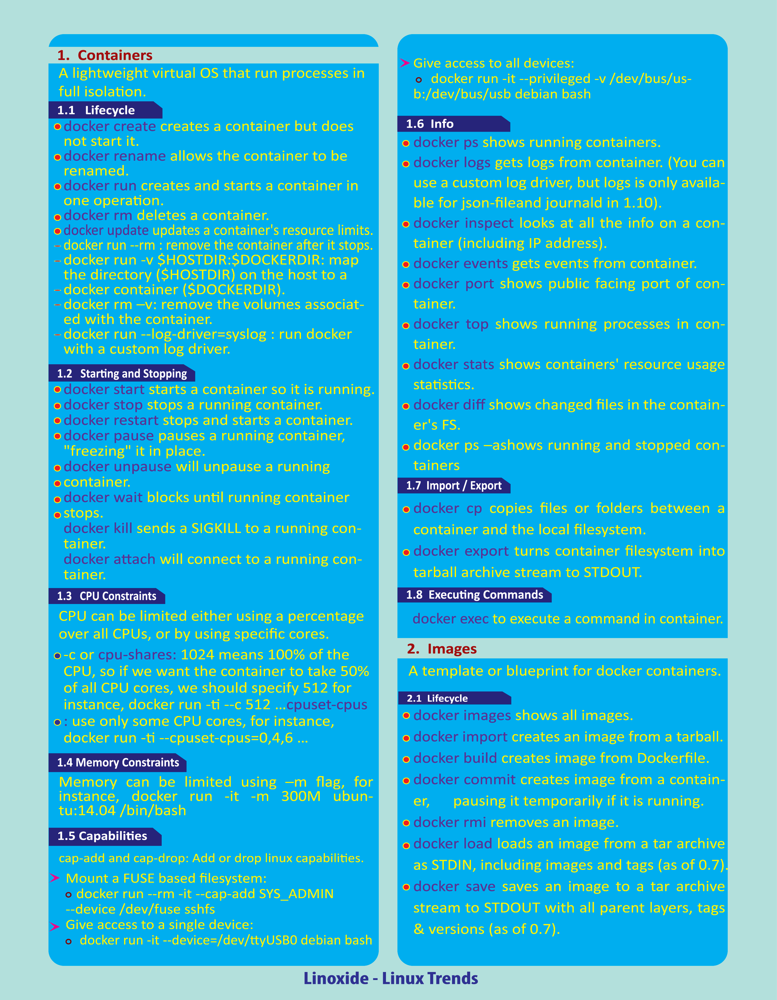
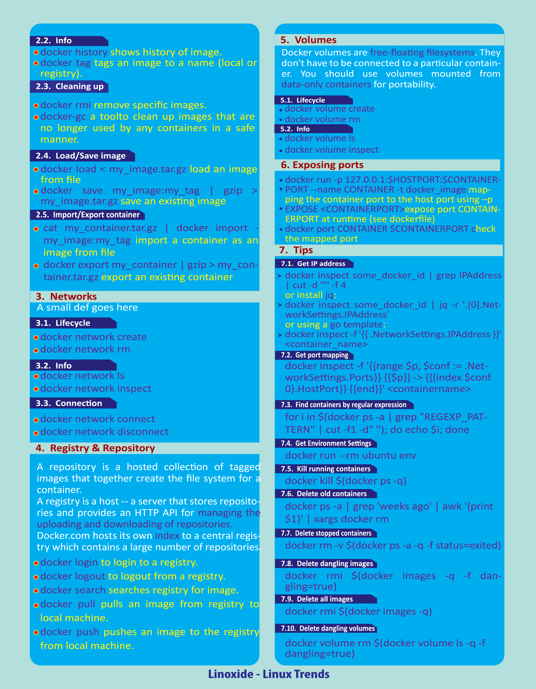

## Rancher

```shell
# На машине для ранчера утсановить докер и запустить команду
docker run -d --name test_rancher --restart=unless-stopped -p 80:80 -p 443:443 -v /home/rancher:/var/lib/rancher --privileged rancher/rancher:v2.5.5
```

### На мастере

```shell
# Проверим статес компонентов
kubectl get componentstatuses
# Если controller-manager и scheduler не в статусе Healthy (а так оно и будет), то выполняем
sed -i 's/- --port=0/#- --port=0/g' /etc/kubernetes/manifests/kube-scheduler.yaml
sed -i 's/- --port=0/#- --port=0/g' /etc/kubernetes/manifests/kube-controller-manager.yaml
systemctl restart kubelet

# Это необходимо для ranchera, чтоб он не ругался на состояние кластера. Данные компоненты deprecated
# И не будут больше поддерживаться. Их забросили, даже не поправив...
# https://github.com/kubernetes/kubernetes/issues/93472
```

#### Дополнительные настройки master node

```shell
# В дефолтной конфигурации мастер-нода не запускает контейнеры, 
# так как занимается отслеживанием состояния кластера и перераспределением ресурсов.
# Ввод данной команды даст возможность запускать контейнеры на мастере.
kubectl taint nodes --all node-role.kubernetes.io/master-

# Проверяем
kubectl -n kube-system get pods -o wide
```

```shell
# Сохраняем полученный yaml, и правим в файле версии, чтоб не получить предупреждение
# rbac.authorization.k8s.io/v1beta1 ClusterRoleBinding is deprecated in v1.17+, unavailable in v1.22+; use rbac.authorization.k8s.io/v1 ClusterRoleBinding
curl --insecure -sfL https://<ip-address>/v3/import/jh5krkd*******.yaml -o ./rancher-connect.yaml
sed -i 's/rbac.authorization.k8s.io\/v1beta1/rbac.authorization.k8s.io\/v1/g' ./rancher-connect.yaml
kubectl apply -f rancher-connect.yaml
```

> #### Отвыет от сервера
> clusterrole.rbac.authorization.k8s.io/proxy-clusterrole-kubeapiserver created
> clusterrolebinding.rbac.authorization.k8s.io/proxy-role-binding-kubernetes-master created
> namespace/cattle-system created
> serviceaccount/cattle created
> clusterrolebinding.rbac.authorization.k8s.io/cattle-admin-binding created
> secret/cattle-credentials-0264047 created
> clusterrole.rbac.authorization.k8s.io/cattle-admin created
> deployment.apps/cattle-cluster-agent created


http://localhost:8001/api/v1/namespaces/kubernetes-dashboard/services/https:kubernetes-dashboard:/proxy/.

More accurate solution to disable checks only of imported clusters:

Enter docker container with rancher Open for editing file /usr/share/rancher/ui/assets/vendor-XXX.js Find code
GRAY_OUT_SCHEDULER_STATUS_PROVIDERS=["azureaks","tencenttke"]
Replace with GRAY_OUT_SCHEDULER_STATUS_PROVIDERS=["azureaks","tencenttke","import"]

### Команды для docker


